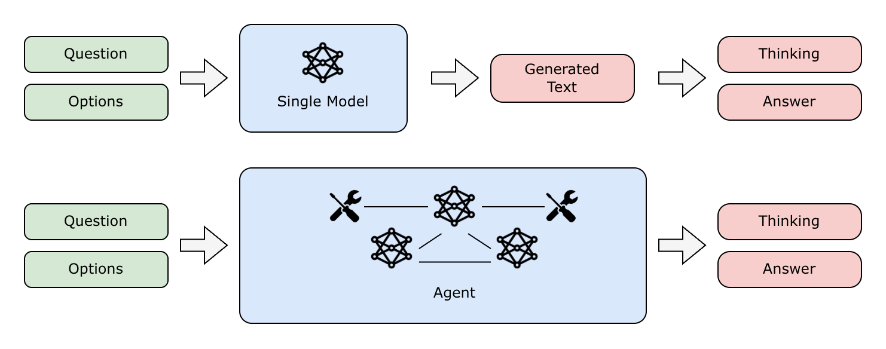

# Baselines for Interspeech 2026 Audio Reasoning Challenge

## Brief Summary
The Interspeech 2026 Audio Reasoning Challenge addresses the limited and unstable reasoning capabilities of current Large Audio Language Models (LALMs) by focusing on Chain-of-Thought (CoT) reasoning in complex acoustic scenarios. It builds upon an enriched MMAR benchmark with manually labeled CoT annotations and explicit reasoning cues. The evaluation criterion is strict: a prediction is correct only if both the reasoning path and the final answer are accurate. The goal is to push LALMs beyond surface-level accuracy toward logically consistent thought processes. 

The challenge features two tracks: 
- **Single Model Track**: focusing on intrinsic model reasoning via post-training of open-source models.
- **Agent Track**: focusing on system-level orchestration and tool use with open-source models. 



## Single Model Track Baseline

### Overview
In the Single-Model Track, participants may continue training any open-source model with open-source data. To facilitate rapid reproduction, we release the following baseline system.

1. Model
   - Qwen3-Omni-30B-A3B-Thinking (checkpoints and documentation: https://huggingface.co/Qwen/Qwen3-Omni-30B-A3B-Thinking).  
   - 30 B parameters; MoE; multimodal (text, audio, video) input and text output.  
   - Supports explicit chain-of-thought generation.

2. Inference protocol
   - For each test item, the model receives the question together with four candidate answers and is prompted to select the correct option.
   - Following the “Think-then-Answer” paradigm, the model first generates an explicit reasoning trace and then outputs a single, final answer.
   - The model's output is then parsed using a **rule-based method** to extract both the chain-of-thought and the final answer.

3. Evaluation
   - The official scorer ingests both the chain-of-thought and the final answer to compute the task score.
   - For your practice, submit a JSONL file with the following format:
      ```json
      {
      "id": "<sample_id>",
      "thinking_prediction": "<model_or_agent_generated_CoT>",
      "answer_prediction": "<final_prediction>"
      }
      ```

Competitors may start from this baseline or adopt any other open-source model.

### Reference Code
We provide a simple baseline for this track to illustrate the inference protocol.

1. Environment
   ```
   transformers==4.57.1
   qwen-omni-utils==0.0.8
   flash-attn==2.7.4.post1
   ```

2. Example Command
   ```bash
   python infer_single_model_baseline.py \
      --qwen3_omni_model_name_or_path PATH/TO/Qwen3-Omni-30B-A3B-Thinking \
      --dataset_meta_path PATH/TO/MMAR-meta.json \
      --dataset_audio_prefix PATH/TO/MMAR/audio \
      --flash_attention True \
      --output_dir outputs/single_model_baseline \
      --max_new_tokens 1024
   ```

## Agent Track Baseline

### Overview
In the Agent Track, participants design an audio reasoning agent that orchestrates multiple open-source models and tools (e.g., ASR, source separation, beat/onset tracking, captioners, planners) to generate a chain-of-thought (CoT) and a final answer.
We also provide a simple baseline for this track to illustrate its distinction from the Single Model Track.

1. System
   - Qwen3-Omni-30B-A3B-Thinking: for generating chain-of-thought and final answer.
   - Qwen3-8B: for parsing the output of Qwen3-Omni-30B-A3B-Thinking to extract CoT and final answer.

2. Evaluation
   - The evaluation method is identical to that of the Single Model Track.

Competitors are required to design and implement their own agent-based approaches.

### Reference Code
We provide a simple baseline for this track to illustrate the inference protocol. 

1. Environment
   ```
   transformers==4.57.1
   qwen-omni-utils==0.0.8
   flash-attn==2.7.4.post1
   ```

2. Example Command
   ```bash
   python infer_agent_baseline.py \
      --qwen3_omni_model_name_or_path PATH/TO/Qwen3-Omni-30B-A3B-Thinking \
      --qwen3_model_name_or_path PATH/TO/Qwen3-8B \
      --dataset_meta_path PATH/TO/MMAR-meta.json \
      --dataset_audio_prefix PATH/TO/MMAR/audio \
      --flash_attention True \
      --output_dir outputs/agent_track_baseline \
      --max_new_tokens 1024
   ```